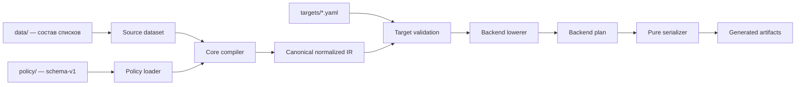

# Universal Routing Engine v2: архитектурный проект

## Статус документа

Этот документ описывает целевую архитектуру Universal Routing Engine v2. Он
не меняет текущую реализацию, policy schema, содержимое `data/`, генераторы,
форматы JSON или release pipeline.

Ограничения проекта:

- текущая сборка Happ должна остаться byte-compatible;
- текущий Xray/3X-UI artifact должен остаться byte-compatible;
- `data/` остаётся единственным источником состава доменных списков;
- `policy/` продолжает определять действия, порядок и fallback в существующей
  schema-v1;
- новые backend не должны добавлять бизнес-логику в существующие генераторы;
- Keenetic, sing-box и Clash/Mihomo в рамках этого документа не реализуются.

## 1. Архитектурные принципы

### 1.1. Разделение источников и представлений

`data/` отвечает на вопрос «какие назначения входят в логический список».
Policy отвечает на вопрос «какое действие выполнить для этого списка».
Target отвечает на вопрос «как логические действия называются на конкретной
платформе». Backend преобразует уже проверенное решение в клиентский формат.

Ни один backend не должен самостоятельно:

- читать файлы из `data/`;
- раскрывать `include:`;
- принимать решение direct/proxy/block;
- менять порядок правил;
- добавлять неявные домены;
- исправлять или ослаблять policy;
- зависеть от другого backend.

### 1.2. Один направленный pipeline



Поток данных всегда направлен слева направо. Serializer не обращается обратно
к policy, `data/` или настройкам другого backend.

### 1.3. Стабильное ядро, сменные backend

Core владеет общей семантикой. Backend владеет только особенностями формата и
ограничениями платформы. Добавление backend не требует изменения Happ, Xray
или других существующих backend.

## 2. Предлагаемая структура каталогов

Структура является целевой. Перенос существующих файлов должен выполняться
отдельными небольшими этапами с golden-тестами.

```text
data/                              # существующие списки; без изменений schema
policy/                            # существующая canonical policy schema-v1
targets/
    happ.yaml                      # существующий target
    xray.yaml                      # существующий target
    sing-box.yaml                  # будущий target
    mihomo.yaml                    # будущий target Clash/Mihomo
    keenetic.yaml                  # будущий target

routing_engine/
    core/
        model.py                   # существующая backend-neutral policy model
        loader.py                  # строгая загрузка schema-v1
        source.py                  # чтение snapshot состава data
        normalize.py               # порядок, дедупликация, canonical values
        resolve.py                 # include/reference resolution
        validate.py                # общие инварианты policy и source data
        ir.py                      # immutable Canonical Routing IR
        errors.py                  # типизированные diagnostics

    compiler/
        compiler.py                # policy + source snapshot -> Canonical IR
        request.py                 # CompileRequest / GenerationContext
        capabilities.py            # capability contract и preflight
        artifacts.py               # GeneratedArtifact и manifest

    backends/
        base.py                    # Backend, Lowerer, Serializer protocols
        registry.py                # регистрация backend по стабильному ID

        happ/
            backend.py             # facade и descriptor
            target.py              # typed target settings
            lower.py               # Canonical IR -> HappPlan
            serialize.py           # HappPlan -> JSON и deeplink
            model.py               # HappPlan

        xray/
            backend.py
            target.py
            lower.py
            serialize.py
            model.py               # XrayPlan

        sing_box/                  # будущий backend с теми же границами
            backend.py
            target.py
            lower.py
            serialize.py
            model.py

        mihomo/                    # будущий Clash/Mihomo backend
            backend.py
            target.py
            lower.py
            serialize.py
            model.py

        keenetic/                  # будущий backend
            backend.py
            target.py
            lower.py
            serialize.py
            model.py

    cli.py                         # orchestration, без бизнес-логики

tests/
    core/                          # parser, resolver, normalization, invariants
    contract/                      # единый contract suite для backend
    backends/
        happ/
        xray/
        sing_box/
        mihomo/
        keenetic/
    golden/                        # стабильные ожидаемые artifacts
    fixtures/                      # policy/data/target snapshots
```

Имена `sing_box` в Python и `sing-box` в target ID различаются только из-за
правил именования Python. Публичный backend ID должен быть `sing-box`.

## 3. Формат входных данных

### 3.1. Source dataset

Состав правил остаётся в существующем формате `data/`, совместимом с
domain-list-community:

```text
include:proxy-video
domain.example
full:exact.example
regexp:...
```

V2 не вводит второй DSL и не копирует эти списки в backend-конфигурации.
Compiler получает immutable snapshot:

```text
SourceSnapshot
  revision            # commit/hash входных data
  domain_sets         # логическое имя -> раскрытый упорядоченный набор
  ip_sets             # логическое имя -> набор IP/CIDR или внешняя ссылка
  source_metadata     # происхождение geosite/geoip
```

Раскрытие `include:`, обнаружение циклов, нормализация доменов и
детерминированная дедупликация выполняются один раз до вызова backend.

### 3.2. Canonical policy

Policy schema-v1 не меняется. Loader преобразует существующие файлы в текущую
backend-neutral `RoutingPolicy`. В v2 запрещено добавлять в policy:

- outbound tag конкретного клиента;
- имена proxy group Clash;
- sing-box outbound IDs;
- номера Keenetic policy/table;
- поля Happ JSON;
- Xray-only domain strategy.

Если текущая schema-v1 уже содержит строку, необходимую для сохранения
совместимости, v2 должен трактовать её через существующее поведение. Очистка
schema является отдельным проектом и не входит в эту архитектурную фазу.

### 3.3. Target settings

Target — backend-specific конфигурация развертывания, но не routing policy.
Она может содержать:

- backend ID;
- имена выходных artifacts;
- mapping логических действий на platform egress;
- DNS и URL ресурсов;
- platform defaults;
- явно выбранный режим обработки unsupported capabilities.

Концептуальный пример будущего target:

```yaml
generator: sing-box
artifact: sing-box-routing.json
egress_bindings:
  direct: direct
  proxy: proxy
  block: block
```

Этот пример не является новой policy schema и не предписывает немедленное
добавление файла.

### 3.4. Generation context

Backend получает один полностью подготовленный объект:

```text
GenerationContext
  policy: CanonicalRoutingIR
  target: TypedTargetSettings
  sources: SourceManifest
  build: BuildMetadata
```

`CanonicalRoutingIR` должен быть immutable и детерминированным. В нём уже
зафиксированы порядок first-match, fallback, enabled rules, раскрытые ссылки и
нормализованные matcher values.

## 4. Интерфейс генератора

### 4.1. Публичный backend contract

Концептуальный интерфейс:

```python
class Backend(Protocol):
    descriptor: BackendDescriptor

    def parse_target(self, raw: Mapping[str, object]) -> TargetSettings: ...
    def capabilities(self, target: TargetSettings) -> CapabilitySet: ...
    def lower(
        self,
        policy: CanonicalRoutingIR,
        target: TargetSettings,
    ) -> BackendPlan: ...
    def serialize(self, plan: BackendPlan) -> tuple[GeneratedArtifact, ...]: ...
```

Это проект интерфейса, а не код для текущего PR.

### 4.2. Backend descriptor

```text
BackendDescriptor
  id                  # happ, xray, sing-box, mihomo, keenetic
  display_name
  contract_version    # версия интерфейса engine/backend
  target_schema       # validator typed target settings
  artifact_kinds      # объявляемые типы outputs
```

Descriptor позволяет CLI и тестам обнаруживать backend без `if backend == ...`
в orchestration-коде.

### 4.3. Lowerer и serializer

Lowerer выполняет только неизбежное platform mapping:

- logical action/egress → platform outbound/group/table;
- canonical matcher → поддерживаемая platform construct;
- canonical rule order → platform rule order;
- fallback → platform final/default action.

Lowerer возвращает typed `BackendPlan`, а не `dict[str, Any]`.

Serializer является чистой функцией:

```text
BackendPlan -> ordered bytes/text artifacts
```

Serializer не принимает `RoutingPolicy`, `data/` или raw target YAML. Это
делает невозможным случайное размещение бизнес-логики в JSON/YAML writer.

### 4.4. Capability preflight

До lowering engine сравнивает используемые policy features с возможностями
backend:

```text
CapabilitySet
  domain_exact
  domain_suffix
  domain_keyword
  domain_regex
  destination_ip
  cidr
  logical_not
  source_match
  protocol_match
  ordered_first_match
  explicit_block
  external_rule_sets
```

Unsupported feature приводит к диагностике до генерации файлов:

```text
E_BACKEND_UNSUPPORTED_MATCHER:
backend keenetic cannot represent domain_regex used by rule proxy-special
```

Молчаливое удаление, расширение или ослабление правила запрещено.

## 5. Формат выходных артефактов

Все outputs представлены общим типом:

```text
GeneratedArtifact
  relative_path       # безопасный путь внутри dist
  media_type
  kind                # routing-profile, import-link, config-fragment, rule-set
  content             # bytes
  backend_id
  deterministic       # должен ли output быть byte-stable
  metadata            # необязательные не-policy сведения
```

Backend не записывает файл самостоятельно. Он возвращает artifacts engine,
который проверяет дубликаты имён и передаёт их существующему build layer.

Предлагаемый output contract:

| Backend | Основные artifacts | Примечание |
| --- | --- | --- |
| Happ | `happ-routing.json`, `happ-routing-link.txt` | Имена и bytes сохраняются без изменений. |
| Xray/3X-UI | `3x-ui-routing.json` | Текущий JSON сохраняется без изменений. |
| sing-box | `sing-box-routing.json` | Фрагмент `route` либо документ, выбранный typed target. |
| Clash/Mihomo | `mihomo-routing.yaml` | Rules и provider references в детерминированном YAML. |
| Keenetic | `keenetic-routing.txt` | Детерминированный CLI/import plan; точный формат определяется при исследовании API устройства. |

Если backend требует несколько файлов, он возвращает несколько artifacts за
один вызов. Например, Mihomo сможет вернуть основной YAML и локальные
rule-provider payloads, а sing-box — config fragment и rule-set files. Имена
должны объявляться target и проверяться на конфликт до записи.

## 6. Подключение новых платформ

### 6.1. Registry

Backend регистрируется один раз по ID:

```text
happ     -> HappBackend
xray     -> XrayBackend
sing-box -> SingBoxBackend
mihomo   -> MihomoBackend
keenetic -> KeeneticBackend
```

CLI выполняет общий алгоритм:

1. загрузить policy и source snapshot;
2. построить один Canonical IR;
3. прочитать target;
4. получить backend из registry;
5. типизировать target;
6. проверить capabilities;
7. вызвать lower;
8. вызвать serialize;
9. проверить artifact contract;
10. вернуть artifacts build layer.

В CLI нет platform-specific ветвлений.

### 6.2. sing-box

Будущий `SingBoxBackend` должен:

- сопоставить logical egress с outbound tags;
- выбрать inline rules или rule sets согласно target;
- сохранить first-match и final action;
- отклонить неподдерживаемые matcher до serialization;
- не читать Happ/Xray target settings.

### 6.3. Clash/Mihomo

Будущий `MihomoBackend` должен:

- сопоставить logical egress с proxy group/policy names;
- формировать ordered `rules`;
- при необходимости создавать rule providers;
- явно определить формат `MATCH` fallback;
- не переиспользовать serializer sing-box, даже если часть YAML похожа.

Общий код допустим только для backend-neutral операций в core.

### 6.4. Keenetic

Keenetic имеет более ограниченную модель, поэтому сначала требуется отдельное
capability research. Backend должен либо точно представить policy, либо
завершиться с actionable diagnostic. Нельзя автоматически превращать regex в
suffix, block в direct или пропускать правила.

Архитектура готова к Keenetic за счёт `CapabilitySet`, typed target и
`BackendPlan`, но формат команд намеренно не фиксируется до проверки реального
Keenetic API/CLI.

## 7. Как избежать дублирования логики

### 7.1. Что должно быть общим

Только core владеет:

- загрузкой и строгой проверкой policy;
- чтением и раскрытием `data/`;
- include graph и cycle detection;
- IDNA/domain/IP/CIDR normalization;
- дедупликацией;
- порядком и priority;
- fallback semantics;
- reference resolution;
- определением используемых capabilities;
- общими diagnostics;
- детерминированным Canonical IR.

Compiler выполняет это один раз на build, после чего один IR может быть передан
нескольким backend.

### 7.2. Что не следует выносить в общий helper

Нельзя создавать общий `json_generator.py` или `yaml_rules.py`, если он знает
семантику конкретных клиентов. Внешне похожие поля часто имеют разные правила
порядка, fallback и matching.

Допустимы инфраструктурные utilities без routing semantics:

- canonical JSON encoding;
- deterministic YAML encoding;
- Base64 encoding;
- SHA-256;
- safe relative path validation.

### 7.3. Никакой связи между backend

Запрещённые зависимости:

```text
MihomoBackend -> XrayGenerator
SingBoxBackend -> HappPlan
KeeneticBackend -> Mihomo target parser
```

Разрешённая зависимость каждого backend только такая:

```text
Backend -> compiler contracts + core IR + infrastructure utilities
```

## 8. Детерминизм и совместимость

Для одинаковых source snapshot, policy и target каждый backend обязан вернуть
одинаковые bytes. Детерминизм включает:

- стабильный порядок правил;
- стабильный порядок ключей, где он влияет на bytes;
- фиксированное форматирование JSON/YAML;
- отсутствие timestamps в deterministic artifacts;
- отсутствие зависимости от порядка файловой системы;
- отсутствие сетевых запросов внутри generator.

Сохранение текущего поведения обеспечивается golden contract:

| Artifact | Обязательство v2 |
| --- | --- |
| `happ-routing.json` | Byte-identical текущему baseline. |
| `happ-routing-link.txt` | Byte-identical текущему baseline. |
| `3x-ui-routing.json` | Byte-identical текущему baseline. |

Перемещение существующих Happ/Xray классов допускается только после появления
golden-тестов и не должно совмещаться с реализацией новых backend.

## 9. Тестовая архитектура

### Core tests

- source include graph и cycles;
- deterministic normalization;
- duplicate handling;
- policy ordering и fallback;
- reference resolution;
- diagnostics с точным source location.

### Backend contract tests

Каждый backend проходит общий suite:

- имеет уникальный descriptor ID;
- принимает только свой typed target;
- не мутирует Canonical IR;
- детерминирован при повторном вызове;
- возвращает безопасные уникальные пути;
- не создаёт partial artifacts при ошибке;
- отклоняет unsupported capabilities.

### Golden tests

- существующие Happ и Xray outputs фиксируются byte-for-byte;
- новые backend получают собственные fixtures и golden artifacts;
- изменение golden-файла требует явного review, а не автоматического rewrite в
  обычном тестовом запуске.

### Cross-backend semantic tests

Один fixture проверяет, что logical direct/proxy/block и fallback представлены
во всех backend одинаково по смыслу. Тест сравнивает normalized backend plans,
а не текст разных форматов.

## 10. Ошибки и diagnostics

Ошибки должны содержать:

- стабильный code;
- backend ID, если ошибка platform-specific;
- rule/set ID;
- source file/line, если доступны;
- объяснение;
- рекомендуемое действие.

Категории:

```text
E_POLICY_*       # schema и semantics
E_SOURCE_*       # data/includes/resources
E_REFERENCE_*    # отсутствующие и циклические references
E_CAPABILITY_*   # backend не может выразить feature
E_TARGET_*       # неверные backend settings
E_ARTIFACT_*     # path, duplicate, encoding, serialization
```

Backend не должен перехватывать core error и превращать его в молчаливый
fallback.

## 11. Поэтапное внедрение после утверждения

Этот план не является разрешением реализовывать этапы вместе.

1. Зафиксировать golden bytes Happ/Xray и contract tests.
2. Ввести общие immutable artifact/request contracts без изменения outputs.
3. Выделить Canonical IR и общий compiler за существующим loader.
4. Разделить Happ lowering и serialization без изменения bytes.
5. Разделить Xray lowering и serialization без изменения bytes.
6. Добавить registry без изменения текущего CLI поведения.
7. Добавить capability preflight.
8. Исследовать и отдельно реализовать sing-box.
9. Исследовать и отдельно реализовать Clash/Mihomo.
10. Исследовать возможности Keenetic и только затем реализовать backend.

Каждый этап — отдельный PR. Новые backend не должны добавляться до стабилизации
контрактов core и сохранения golden compatibility существующих outputs.

## 12. Архитектурные решения

### Принято

- `data/` остаётся источником состава destination sets.
- Policy schema-v1 остаётся без изменений.
- Core формирует единый backend-neutral Canonical IR.
- Backend состоит из typed target parser, capability declaration, lowerer и
  pure serializer.
- Backend подключаются через registry.
- Outputs представлены общим artifact contract.
- Happ и Xray bytes защищаются golden-тестами.

### Не принято

- генерация одной платформы через генератор другой;
- чтение `data/` внутри backend;
- backend-specific значения в policy;
- silent capability degradation;
- общий untyped `dict` как backend plan;
- реализация Keenetic, sing-box или Mihomo в рамках архитектурного PR;
- изменение release pipeline для внедрения архитектуры.

## 13. Критерии готовности архитектуры к реализации

Архитектура считается согласованной, когда подтверждено следующее:

- граница между source data, policy, target и backend однозначна;
- Canonical IR содержит всю общую routing semantics;
- generator contract не требует доступа к файловой системе или сети;
- unsupported features обнаруживаются до serialization;
- новый backend добавляется новым каталогом и registry entry;
- добавление backend не требует редактирования существующих backend;
- текущие Happ/Xray artifacts имеют обязательный byte-compatible contract;
- каждый последующий этап может быть выполнен отдельным PR.
