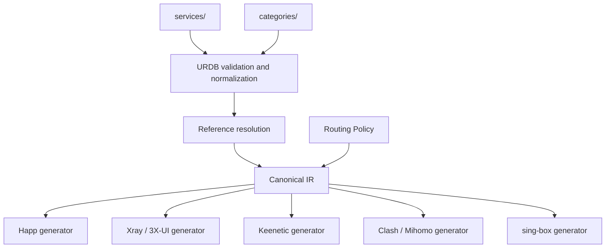

# Universal Routing Database (URDB)

## Статус документа

Этот документ описывает целевую архитектуру Universal Routing Database. Он не меняет текущую реализацию, формат Routing Policy, каталог `data/`, генераторы или release pipeline.

URDB вводится как независимый слой данных о сервисах. Переход на него должен выполняться отдельно, после реализации схемы, валидатора и проверок совместимости.

## 1. Назначение URDB

Universal Routing Database — это единая, платформонезависимая база знаний о сетевых сервисах и их принадлежности к логическим категориям.

URDB отвечает на два вопроса:

1. Какие сетевые ресурсы принадлежат конкретному сервису?
2. В какие логические категории входит этот сервис?

URDB не решает, куда направлять трафик. Решение `direct`, `proxy`, `block` или выбор другого логического egress остаётся ответственностью Routing Policy.

Таким образом, источники истины разделены по смыслу:

- URDB — источник истины о составе сервисов и категорий;
- Routing Policy — источник истины о правилах маршрутизации;
- backend target/configuration — источник истины о соответствии логических egress конкретным возможностям платформы.

Это разделение не позволяет доменным спискам одновременно стать скрытой политикой маршрутизации.

## 2. Что такое Service

`Service` — стабильный логический объект, описывающий один внешний продукт, платформу или связанную экосистему сетевых ресурсов.

Примеры Service:

- `youtube`;
- `telegram`;
- `whatsapp`;
- `discord`;
- `signal`;
- `viber`;
- `chatgpt`;
- `claude`;
- `gemini`;
- `github`.

Service имеет стабильный идентификатор и набор типизированных сетевых признаков. В первой версии это прежде всего домены и доменные суффиксы. В дальнейшем модель может поддержать IP/CIDR, ASN и другие matcher-типы, если они присутствуют в canonical policy model.

Концептуальный пример, не являющийся утверждённой схемой реализации:

```yaml
schema_version: 1
kind: Service
id: youtube

metadata:
  name: YouTube
  description: Video platform and supporting delivery infrastructure

matchers:
  domains:
    - suffix: youtube.com
    - suffix: youtu.be
    - suffix: googlevideo.com
    - suffix: ytimg.com
    - exact: youtubei.googleapis.com
    - suffix: ggpht.com
    - suffix: gvt1.com

sources:
  - upstream: v2fly/domain-list-community
    reference: youtube
```

Service не должен содержать:

- `direct`, `proxy` или `block`;
- имя VPN-подключения;
- Xray outbound tag;
- Keenetic policy name;
- синтаксис Happ, Clash, sing-box или другого backend;
- порядок выполнения routing rules;
- пользовательские DNS-настройки.

### 2.1. Идентичность Service

Идентификатор Service должен быть:

- уникальным во всей URDB;
- написан в нижнем регистре;
- стабилен во времени;
- независим от имени upstream-набора или backend-тега;
- пригоден для ссылок из categories и policy.

Переименование Service является миграцией данных. Для совместимости могут использоваться явные aliases, но два разных идентификатора не должны неявно описывать один и тот же сервис.

### 2.2. Границы Service

Один Service должен соответствовать понятному пользователю продукту или экосистеме. Общая CDN-инфраструктура включается только тогда, когда её принадлежность сервису доказана и не создаёт чрезмерно широкого совпадения.

Если домен используется несколькими сервисами, он не должен копироваться без объяснения. Возможные решения:

- выделить общий инфраструктурный Service;
- сохранить совпадение в нескольких Service с явной причиной;
- оставить ресурс вне Service, если его нельзя безопасно классифицировать.

## 3. Почему Service становится единственным источником правил

Под «единственным источником правил» в URDB понимается единственный источник сетевого состава сервисов. Домены, IP-наборы и иные признаки сервиса определяются в `services/` и не дублируются вручную в categories, generators или backend-конфигурациях.

Это даёт следующие свойства:

- исправление домена выполняется один раз;
- все backend получают одинаковое представление сервиса;
- категории не владеют копиями доменных списков;
- генераторы не содержат скрытую бизнес-логику;
- можно проследить происхождение каждого matcher до Service;
- можно тестировать полноту и пересечения независимо от платформы;
- добавление backend не требует создания новой базы доменов.

Category композирует Services, но не повторяет их matchers. Routing Policy ссылается на Service или Category и назначает им action/egress. Canonical IR получает уже разрешённые, проверенные и нормализованные matchers.

Ни один backend не должен читать `services/` или `categories/` напрямую. Это гарантирует, что разрешение ссылок, дедупликация и нормализация происходят один раз в core.

## 4. Categories

`Category` — логическая группа Service, предназначенная для повторного использования в policy и для формирования агрегированных наборов.

Начальный набор категорий:

- `video`;
- `messenger`;
- `social`;
- `ai`;
- `developer`;
- `music`;
- `streaming`;
- `gaming`.

Концептуальный пример:

```yaml
schema_version: 1
kind: Category
id: ai

services:
  - chatgpt
  - claude
  - gemini
```

Category содержит только ссылки на Services или, если это будет разрешено схемой, на другие Categories. Она не должна содержать необработанные домены, backend-синтаксис или routing actions.

Один Service может входить в несколько Categories. Например, `youtube` может относиться к `video` и `streaming`, а `discord` — к `messenger`, `social` и `gaming`.

Если будут разрешены вложенные Categories, валидатор обязан обнаруживать циклы и выдавать детерминированную цепочку ошибок. Для первой версии предпочтительнее плоский список Services: он проще, предсказуемее и исключает циклические зависимости.

## 5. Предлагаемая структура каталогов

```text
services/
    youtube.yaml
    telegram.yaml
    whatsapp.yaml
    discord.yaml
    signal.yaml
    viber.yaml
    chatgpt.yaml
    claude.yaml
    gemini.yaml
    github.yaml
    ...

categories/
    video.yaml
    messenger.yaml
    social.yaml
    ai.yaml
    developer.yaml
    music.yaml
    streaming.yaml
    gaming.yaml
    ...

schemas/
    service-v1.schema.json
    category-v1.schema.json

tests/
    urdb/
        fixtures/
        expected/
```

Каталоги `schemas/` и `tests/urdb/` показаны как целевое место будущей реализации. В рамках этого документа они не создаются.

### 5.1. `services/`

Каждый файл описывает ровно один Service. Имя файла совпадает с `id`. Файл владеет сетевыми признаками, метаданными происхождения и необходимыми пояснениями.

### 5.2. `categories/`

Каждый файл описывает ровно одну Category. Файл владеет только составом категории и её метаданными. Сетевые matchers остаются в `services/`.

### 5.3. `schemas/`

Версионированные схемы определяют допустимую структуру Service и Category. Обновление схемы не должно молча менять смысл существующих данных.

### 5.4. `tests/urdb/`

Будущие тесты должны проверять валидность, разрешение ссылок, детерминизм, отсутствие неизвестных Services, циклы, дубликаты и соответствие golden-файлам.

## 6. Поток генерации



В краткой форме:

```text
services
      ↓
categories
      ↓
canonical IR
      ↓
Happ · Xray · Keenetic · Clash/Mihomo · sing-box
```

На практике Routing Policy также участвует в построении IR: URDB сообщает, *что* относится к Service, а policy сообщает, *какое действие* выполнить.

### 6.1. Validation

До построения IR core проверяет:

- версию схемы;
- уникальность идентификаторов;
- совпадение имени файла и `id`;
- существование всех ссылок;
- корректность matcher-типов;
- отсутствие точных дубликатов;
- корректность доменных имён и CIDR;
- отсутствие запрещённых backend-полей;
- отсутствие циклов, если вложенные ссылки разрешены.

### 6.2. Normalization

Core приводит данные к детерминированному виду:

- канонизирует регистр доменов;
- удаляет завершающую точку там, где это предусмотрено схемой;
- нормализует IDN по одному утверждённому правилу;
- сортирует элементы стабильным алгоритмом;
- удаляет семантически эквивалентные дубликаты;
- сохраняет provenance для диагностики.

Один и тот же commit и набор входов должны давать byte-identical canonical IR.

### 6.3. Reference resolution

Core раскрывает ссылки Category → Service и Policy → Service/Category. Результат содержит типизированные matchers и информацию об их происхождении.

Generators получают только разрешённый canonical IR. Они не выполняют поиск Services, не читают YAML URDB и не решают, к какой Category относится домен.

## 7. Использование Service для Happ

Happ generator получает из canonical IR уже разрешённые rules, matchers, actions и logical egress.

Для Happ core может представить Service как:

- ссылку на скомпилированный geosite tag, если формат и runtime это поддерживают;
- детерминированный список доменных matcher;
- сочетание domain и IP sets в пределах capabilities Happ.

Happ generator отвечает только за преобразование IR в существующий Happ profile и import link. Он не определяет состав `youtube`, `telegram` или `chatgpt` и не назначает им proxy самостоятельно.

DNS defaults, формат ссылки и порядок полей Happ остаются backend-конфигурацией и не входят в Service.

Переход на URDB должен сопровождаться golden-тестом, подтверждающим byte-identical Happ artifacts для эквивалентных текущих данных.

## 8. Использование Service для Xray / 3X-UI

Xray generator получает те же разрешённые rules из canonical IR.

В зависимости от выбранной стратегии serializer может формировать:

- `geosite:<tag>` для заранее собранного набора;
- массив `domain:`, `full:` и `regexp:` значений;
- `geoip:<tag>` или CIDR для IP matchers;
- outbound tag, сопоставленный с logical egress в target configuration.

3X-UI использует Xray-compatible routing JSON. URDB не знает ни структуру JSON, ни теги outbound. Эти детали принадлежат Xray/3X-UI backend.

Порядок Xray rules определяется canonical policy execution model, а не порядком файлов в `services/`.

## 9. Использование Service для Keenetic

Keenetic generator читает только canonical IR и преобразует поддерживаемые domain matchers в импортируемые доменные списки.

Например, Service `youtube` или Category `video` могут быть материализованы в отдельный `.txt` artifact. Состав файла получается из URDB через core, а не чтением `services/youtube.yaml` внутри generator.

Backend обязан:

- сериализовать только поддерживаемые типы matcher;
- проверять capabilities до генерации;
- выдавать явную ошибку для неподдерживаемой семантики;
- сохранять детерминированный порядок строк.

Названия Keenetic policies, интерфейсов и подключений не являются частью Service.

## 10. Будущее использование для sing-box

sing-box generator сможет преобразовывать canonical IR в:

- inline routing rules;
- локальные или удалённые rule-set;
- domain, domain_suffix, domain_keyword и domain_regex;
- IP/CIDR matchers;
- logical egress, сопоставленные sing-box outbound tags.

Service остаётся неизменным: различается только lowering и serialization. Если sing-box не поддерживает часть matcher-семантики выбранного schema version, incompatibility должна обнаруживаться capability validation до записи artifacts.

## 11. Будущее использование для Clash / Mihomo

Clash/Mihomo generator сможет формировать:

- классические rules;
- domain/IP rule-providers;
- payload-наборы для Services и Categories;
- policy group mapping для logical egress.

Решение о выборе `DOMAIN`, `DOMAIN-SUFFIX`, `DOMAIN-KEYWORD`, `IP-CIDR` или другого backend-типа принимается по типу matcher в IR. Generator не анализирует строку эвристически и не поддерживает собственную копию доменной базы.

Особенности Mihomo могут быть представлены capabilities конкретного target, не изменяя Service ради одного backend.

## 12. Canonical IR как контракт

Canonical IR является единственным входом generators. Для каждого разрешённого matcher он должен предоставлять как минимум:

- matcher type и нормализованное значение;
- Service ID;
- Category IDs, через которые matcher был выбран;
- Rule ID и policy action;
- logical egress;
- provenance исходного файла и элемента;
- стабильный порядок.

IR не должен содержать готовые строки `geosite:`, Xray JSON fragments, Happ URLs, Keenetic commands или Clash rules. Такие строки появляются только на backend lowering/serialization stage.

## 13. Разделение ответственности

| Слой | Ответственность | Не отвечает за |
|---|---|---|
| Service | Сетевой состав одного сервиса | Routing action, backend format |
| Category | Группировка Services | Доменные списки, egress |
| Routing Policy | Rule order, matchers/references, action, logical egress | Backend syntax |
| Core / resolver | Validation, reference resolution, normalization, IR | Формат artifacts |
| Target configuration | Egress mapping и backend defaults | Состав Services |
| Generator | Lowering и serialization canonical IR | Business logic и чтение URDB |

## 14. Как избежать дублирования логики

Общая логика должна существовать только в core:

- загрузка и schema validation;
- построение registry Services/Categories;
- разрешение ссылок;
- нормализация matcher;
- дедупликация;
- проверка конфликтов;
- вычисление стабильного порядка;
- capability validation;
- формирование provenance.

Generators реализуют один контракт: `canonical IR + target configuration → artifacts`. Добавление нового backend создаёт новый adapter/serializer и capability declaration, но не требует изменений существующих generators или URDB.

Недопустимые формы дублирования:

- список YouTube-доменов внутри Happ generator;
- отдельная Category mapping в Keenetic generator;
- особая дедупликация только для Xray;
- backend-specific include в Service;
- повторная загрузка YAML в каждом generator.

## 15. Конфликты и пересечения

Пересечение Services само по себе не всегда ошибка, но должно быть видимым. Validator должен формировать отчёт о matcher, принадлежащих нескольким Services.

Если разные policy rules назначают пересекающимся Services разные actions, результат определяется canonical rule execution model. URDB не разрешает routing conflict и не меняет порядок rules.

Для опасных пересечений могут использоваться validation levels:

- error — неоднозначность нарушает схему или безопасность;
- warning — пересечение допустимо, но требует внимания;
- informational — ожидаемая общая инфраструктура.

Исключения должны быть явными, документированными и проверяемыми, а не спрятанными в generator.

## 16. Provenance и обновление данных

Каждый Service должен позволять установить происхождение правил:

- ручная запись с обоснованием;
- ссылка на upstream dataset;
- официальный список доменов;
- issue или commit, добавивший правило;
- дата последней проверки, если это требуется процессом сопровождения.

Upstream import не должен напрямую менять artifacts. Импортированные данные проходят validation, normalization, review и тесты URDB.

Автоматическое обновление должно создавать обозримый diff на уровне Services, чтобы reviewer видел, какой сервис получил или потерял домен.

## 17. Версионирование

Service и Category содержат явный `schema_version`. Версия относится к структуре и семантике документа, а не к версии конкретного сервиса.

Правила развития:

- совместимые добавления не меняют смысл существующих полей;
- несовместимая семантика требует новой schema version;
- core явно перечисляет поддерживаемые версии;
- неизвестная версия завершается ошибкой до генерации;
- миграции выполняются отдельным слоем и выдают canonical representation;
- generators не поддерживают версии URDB самостоятельно.

Версия самой базы может фиксироваться Git commit и отражаться в release metadata для воспроизводимости.

## 18. Проверки качества

Перед использованием URDB в production сборке должны существовать автоматические проверки:

- все Service и Category проходят schema validation;
- ссылки разрешаются полностью;
- нет неожиданных циклов и дубликатов;
- normalization детерминирована;
- повторная сборка даёт byte-identical IR;
- все используемые policy references существуют;
- capability conflicts обнаруживаются до генерации;
- provenance доступен для каждого output matcher;
- golden artifacts Happ и Xray не меняются при эквивалентном переносе;
- Keenetic domain lists остаются семантически и byte-совместимыми там, где это требуется.

## 19. Подключение нового backend

Новый backend подключается без изменения Services и Categories:

1. Объявляет capability profile.
2. Получает canonical IR через общий interface.
3. Выполняет backend lowering только для поддерживаемых конструкций.
4. Сериализует artifacts в собственный output directory.
5. Добавляет contract и golden tests.

Новый backend не должен требовать редактирования Happ, Xray или Keenetic generators. Если для него не хватает общей семантики, сначала обсуждается расширение canonical policy/IR, а не добавление специальных полей в Service.

## 20. План безопасного перехода

URDB не должна заменять текущие данные одним большим изменением. Рекомендуемая последовательность:

1. Утвердить Service/Category schemas и naming rules.
2. Реализовать loader, validator и normalizer отдельно от generators.
3. Инвентаризировать текущие `data/` и policy references.
4. Переносить правила в Services небольшими проверяемыми группами.
5. Строить canonical IR из старого и нового источника в comparison mode.
6. Подтвердить semantic и byte compatibility существующих Happ, Xray и Keenetic artifacts.
7. Переключить core на URDB только после прохождения golden tests.
8. Удалять legacy source после объявленного периода совместимости.

Во время перехода должен быть ровно один авторитетный источник для каждого правила. Нельзя разрешать ручное редактирование одной и той же записи одновременно в `data/` и `services/`.

## 21. Не входит в этот этап

Этот этап не включает:

- создание файлов в `services/` или `categories/`;
- изменение `data/`;
- изменение Routing Policy schema;
- реализацию loader, resolver или canonical IR;
- изменение Happ, Xray/3X-UI или Keenetic;
- реализацию Clash/Mihomo или sing-box;
- изменение build/release workflows;
- миграцию существующих правил;
- изменение текущих artifacts.

Результат этапа — только архитектурное определение URDB и границ её ответственности.
