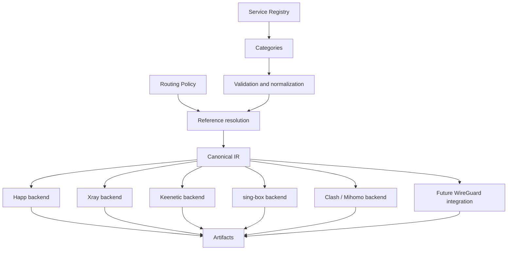

# Universal Routing Database: долгосрочное видение

## Статус документа

Этот документ определяет долгосрочное направление развития Universal Routing Database (URDB) как верхнеуровневой концепции проекта.

Он не является спецификацией формата данных, планом немедленной миграции или описанием нового backend. Документ не меняет существующие `policy`, `data/`, генераторы, артефакты и release pipeline.

## 1. Миссия проекта

Universal Routing Database — открытая единая база знаний о сетевых сервисах и маршрутизации.

Миссия URDB — предоставить проверяемое, воспроизводимое и независимое от платформы описание интернет-сервисов, из которого можно последовательно получать routing-конфигурации для разных систем.

Сегодня сведения об одном сервисе часто распределены между доменными списками, IP-наборами, конфигурациями клиентов и backend-specific правилами. Это приводит к расхождениям: один backend знает больше доменов, другой использует устаревшую категорию, третий содержит ручное исключение, происхождение которого невозможно установить.

URDB должна устранить эту фрагментацию. Сервис описывается один раз, проходит общую проверку и через canonical IR становится доступен всем поддерживаемым backend.

При этом проект разделяет три независимые области ответственности:

- URDB знает, какие сетевые ресурсы относятся к сервису;
- Routing Policy определяет, какое действие и logical egress применить;
- backend преобразует canonical IR в формат конкретной платформы.

URDB не подменяет Routing Policy и не превращает имя сервиса в неявное решение `direct`, `proxy` или `block`.

## 2. Основные принципы

### 2.1. Один источник данных

Состав каждого интернет-сервиса хранится в одном авторитетном объекте Service. Домены, IP-диапазоны, ссылки на upstream-наборы и метаданные не копируются вручную между платформами.

Изменение Service должно автоматически отражаться во всех совместимых output artifacts после прохождения validation и review.

### 2.2. Отсутствие дублирования

Categories группируют Services ссылками, а не повторяют их содержимое. Generators получают canonical IR и не ведут собственные каталоги доменов или IP.

Общая логика разрешения ссылок, нормализации, дедупликации и проверки находится в core. Backend отвечает только за поддерживаемое преобразование и serialization.

### 2.3. Детерминированная сборка

Одинаковые версии URDB, Routing Policy, upstream inputs и toolchain должны создавать byte-identical canonical IR и, где это применимо, byte-identical artifacts.

Порядок файлов в файловой системе, время запуска и сетевые ответы без зафиксированной версии не должны влиять на результат.

Каждый release должен позволять определить:

- commit проекта;
- версию URDB;
- версии upstream-наборов;
- версию schema и compiler;
- контрольные суммы artifacts.

### 2.4. Backend-agnostic

Service не содержит синтаксис Happ, Xray, Keenetic, sing-box, Clash/Mihomo или другой платформы. Он описывает факты о сервисе типизированными, платформонезависимыми данными.

Имена outbound, сетевых интерфейсов, routing tables, profile URLs и policy groups принадлежат target configuration и backend layer.

### 2.5. Расширяемость

Новый Service, Category, matcher type или backend должен подключаться через стабильные контракты.

Добавление backend не должно требовать редактирования существующих generators. Добавление сервиса не должно требовать копирования его правил в каждый backend.

Расширение модели выполняется версионированно и с заранее определённой миграцией.

### 2.6. Проверяемость

Любое правило должно иметь происхождение, статус и автоматические проверки. Из canonical IR должна быть доступна трассировка до Service, Category, Routing Policy rule и исходного upstream reference.

Сборка должна завершаться ошибкой при нарушении обязательных инвариантов и формировать понятные предупреждения для неоднозначных, но допустимых ситуаций.

## 3. Что такое Service

Service — самостоятельный, стабильно идентифицируемый объект, представляющий интернет-сервис, продукт или ясно очерченную сетевую экосистему.

Примеры:

- YouTube;
- Telegram;
- WhatsApp;
- Discord;
- GitHub;
- ChatGPT;
- Steam;
- Spotify;
- Netflix;
- Signal;
- Claude;
- Google Gemini.

Service описывает сервис как сущность, а не как случайный список доменов. Его идентификатор должен оставаться стабильным при изменении инфраструктуры, брендинга или upstream-категории.

Границы Service должны быть понятны человеку. Общая CDN, cloud provider или shared analytics infrastructure не включается автоматически только потому, что используется приложением. Широкие зависимости должны моделироваться явно и не должны незаметно захватывать трафик других сервисов.

Один Service может:

- включать несколько доменных зон и IP-наборов;
- использовать несколько платформ и приложений;
- входить в несколько Categories;
- ссылаться на несколько проверяемых источников;
- иметь временно неполное покрытие с явным статусом и предупреждением.

Service не содержит routing action. Например, `youtube` не означает `proxy`: конкретная Routing Policy может направить его в `internet`, `vpn`, `wan2`, `office` или другой logical egress.

## 4. Что хранит Service

Целевая модель Service может содержать следующие группы данных.

### 4.1. Идентичность

- стабильный машинный идентификатор;
- человекочитаемое имя;
- описание и границы сервиса;
- aliases для исторических или альтернативных названий.

### 4.2. Классификация

- одна основная Category;
- дополнительные Categories;
- тип сервиса или инфраструктурная роль;
- признаки shared infrastructure, если они необходимы.

Category не должна определять маршрут. Она нужна для организации, аудита и ссылок из policy.

### 4.3. Сетевые данные

- ссылки на geosite-наборы;
- ссылки на geoip/OpenCCK-наборы;
- дополнительные exact domains;
- domain suffixes;
- при необходимости keywords и regex;
- дополнительные IP и CIDR;
- документированные исключения.

Ссылки на upstream и дополнительные значения должны быть типизированы. Generator не должен угадывать семантику строки по её внешнему виду.

### 4.4. Платформы

- web;
- iOS;
- Android;
- Windows;
- macOS;
- Linux;
- игровые консоли;
- Smart TV или другие релевантные среды.

Поле platforms описывает доступность или поверхность сервиса и может использоваться для аудита. Оно не содержит platform-specific routing configuration.

### 4.5. Состояние и качество

- lifecycle status: active, deprecated, unavailable или review-needed;
- уровень полноты покрытия;
- известные ограничения;
- предупреждения о shared infrastructure;
- дата последней успешной проверки;
- дата последнего содержательного изменения.

### 4.6. Происхождение

- официальный источник, если доступен;
- upstream repository и имя набора;
- версия или commit upstream;
- ссылка на issue/PR с обоснованием ручного правила;
- метод проверки.

Источник — обязательная часть доверия к данным. Запись без понятного происхождения должна быть видна в Routing Audit.

### 4.7. Концептуальный пример

Ниже показана смысловая модель, а не утверждённая schema:

```yaml
service: youtube
name: YouTube
categories:
  primary: video
  additional:
    - streaming
network:
  geosite:
    - youtube
  geoip_opencck: []
  additional_domains:
    - gvt1.com
  additional_ips: []
platforms:
  - web
  - ios
  - android
  - smart-tv
status: active
sources:
  - type: upstream
    name: v2fly/domain-list-community
last_verified: YYYY-MM-DD
```

Точная schema должна быть спроектирована и утверждена отдельным этапом.

## 5. Категории

Category объединяет Services по понятному назначению. Она является логической группой и не владеет копиями сетевых правил.

Целевой начальный каталог Categories:

| Category | Назначение |
|---|---|
| Video | Видеоплатформы и видеохостинги |
| Messenger | Сервисы обмена сообщениями и звонков |
| Social | Социальные сети и сообщества |
| AI | Пользовательские и developer AI-сервисы |
| Developer | Репозитории, registries и инструменты разработки |
| Gaming | Игровые платформы, магазины и сетевые сервисы игр |
| Streaming | Потоковые аудио- и видеосервисы |
| Finance | Банки, платежи, биржи и финансовые сервисы |
| Cloud | Cloud providers, storage и SaaS infrastructure |
| Security | Security vendors, PKI и защитные сервисы |
| Music | Музыкальные каталоги и аудиоплатформы |
| Education | Образовательные платформы и библиотеки |
| Shopping | Интернет-магазины и marketplaces |
| Government | Государственные и муниципальные сервисы |
| News | Новостные издания и агрегаторы |
| CDN | Явно моделируемая content delivery infrastructure |

Service может входить в несколько Categories. Например, YouTube относится к Video и Streaming, Discord — к Messenger, Social и Gaming, GitHub — к Developer и Cloud.

Для отчётности у Service должна быть одна primary Category. Дополнительные Categories отражают другие реальные способы использования. Это не меняет порядок routing rules.

CDN требует особенно строгой модели. Такая Category не должна использоваться как удобная корзина для неизвестных доменов: широкое правило CDN способно затронуть множество несвязанных сервисов.

## 6. Генерация

Целевой поток данных:

```text
Service
   ↓
Category
   ↓
Canonical IR
   ↓
Backend
   ↓
Artifacts
```

Расширенное представление:



Этапы имеют чёткие границы:

1. Service Registry предоставляет факты о сервисах.
2. Categories предоставляют логическую классификацию.
3. Core валидирует, нормализует и разрешает ссылки.
4. Routing Policy добавляет порядок rules, actions и logical egress.
5. Canonical IR становится единственным входом backend.
6. Backend выполняет capability-aware lowering и serialization.
7. Artifacts сопровождаются metadata, checksums и audit report.

Backend не читает Service Registry напрямую. Иначе каждый backend начнёт по-разному разрешать include, дубликаты и исключения.

## 7. Поддерживаемые платформы

### Happ

Happ получает routing profile и import artifacts из canonical IR. URDB не знает формат Happ URL, DNS defaults или структуру профиля.

### Xray / 3X-UI

Xray backend преобразует типизированные matchers и logical egress в routing JSON и совместимые geosite/geoip references. URDB не хранит outbound tags.

### Keenetic

Keenetic backend формирует поддерживаемые списки и конфигурационные artifacts. Неподдерживаемая семантика должна обнаруживаться capability validation, а не молча отбрасываться.

### sing-box

Будущий backend сможет создавать inline rules и rule-sets, используя тот же canonical IR и отдельное сопоставление logical egress с outbound.

### Clash / Mihomo

Будущий backend сможет создавать rules, rule-providers и policy group mappings без собственной копии Service data.

### WireGuard

WireGuard рассматривается как будущая интеграция, а не как полноценный routing language. Поскольку WireGuard сам по себе задаёт туннели и AllowedIPs, но не доменные правила, интеграция может потребовать платформенный routing layer рядом с WireGuard.

URDB не должна искажать общую модель ради ограничений WireGuard. Возможности и ограничения фиксируются отдельным capability profile.

## 8. Автоматические проверки

URDB должна проверяться до построения release artifacts.

### 8.1. Полнота покрытия

Для каждого Service проверяется наличие достаточных данных, источников, Category и даты проверки. Уровень покрытия должен быть измеримым, а не субъективным статусом без критериев.

### 8.2. Битые include

Все ссылки на Service, Category, geosite и geoip/OpenCCK должны разрешаться. Неизвестная или циклическая ссылка завершает сборку до запуска backend.

### 8.3. Дубликаты

Проверяются:

- точные дубликаты внутри Service;
- эквивалентные matchers после нормализации;
- неожиданные пересечения между Services;
- повторное включение Service через несколько Category paths.

Допустимые пересечения должны иметь явное объяснение.

### 8.4. Исчезнувшие geosite

Если используемая upstream geosite category исчезла, была переименована или стала пустой, сборка не должна незаметно продолжаться со старым предположением. Изменение фиксируется как ошибка либо требующее review предупреждение согласно policy качества.

### 8.5. Исчезнувшие OpenCCK

Аналогично проверяются geoip/OpenCCK references. Исчезновение набора, резкое уменьшение количества prefixes или смена его семантики должно быть отражено в audit diff.

### 8.6. Новые upstream категории

Автоматический мониторинг сравнивает upstream registry с известным snapshot. Новые категории не включаются автоматически в Service, но появляются в отчёте как кандидаты на классификацию и review.

### 8.7. Дополнительные инварианты

- schema version поддерживается core;
- Service ID уникален и стабилен;
- домены и IP корректно нормализуются;
- сборка воспроизводима;
- canonical IR не содержит backend-specific strings;
- все backend artifacts ссылаются на текущий commit;
- unsupported capabilities обнаружены до serialization.

## 9. Routing Audit

После каждой сборки автоматически формируется Routing Audit — человекочитаемый и машиночитаемый отчёт о состоянии базы и результате компиляции.

Audit не заменяет тесты. Он показывает качество покрытия, изменения upstream, предупреждения и влияние новой версии на artifacts.

### 9.1. Сводка Coverage

Минимальный отчёт содержит разделы:

- Video;
- Messenger;
- AI;
- Gaming;
- Streaming;
- Developer;
- остальные зарегистрированные Categories.

Для каждой Category отображаются:

- количество Services;
- количество active, deprecated и review-needed Services;
- покрытие geosite;
- покрытие geoip/OpenCCK;
- число Services с additional domains/IP;
- дата самого старого last verification;
- ошибки и предупреждения;
- изменение относительно предыдущей сборки.

### 9.2. Пример представления

| Category | Services | Coverage | Warnings | Status |
|---|---:|---:|---:|---|
| Video | 12 | 96% | 1 | Review |
| Messenger | 9 | 100% | 0 | Pass |
| AI | 14 | 93% | 2 | Review |
| Gaming | 18 | 88% | 4 | Review |
| Streaming | 11 | 98% | 0 | Pass |
| Developer | 16 | 100% | 0 | Pass |

Цифры приведены только как пример формата, а не как фактическое состояние проекта.

### 9.3. Audit diff

Для каждого build следует показывать:

- добавленные и удалённые Services;
- добавленные и удалённые upstream categories;
- изменения доменов, IP и prefixes;
- Services с ухудшившимся coverage;
- новые пересечения;
- изменения capability compatibility;
- backend artifacts, изменившиеся без изменения соответствующего Service или policy.

Audit должен быть доступен как CI artifact и, для release build, как release metadata или отдельный release artifact.

## 10. Дорожная карта

### v2 — Модульные backend

Цель: стабильный interface generator, canonical input и независимые backend modules.

Критерий завершения: существующие Happ и Xray сохраняют совместимость, Keenetic подключён без чтения source data напрямую, новый backend добавляется без редактирования существующих generators.

### v3 — URDB

Цель: формальная модель Service и Category, schema, validation, normalization и разрешение ссылок.

Критерий завершения: URDB способна представить текущие данные, а сравнение со старым источником подтверждает эквивалентность artifacts.

### v4 — Service Registry

Цель: полный каталог Services с ownership, provenance, lifecycle status, platforms и историей проверки.

Критерий завершения: все production rules трассируются до зарегистрированного Service или до явно документированного инфраструктурного объекта.

### v5 — Automatic Audit

Цель: автоматическая оценка coverage, пересечений, устаревших данных, upstream drift и backend compatibility.

Критерий завершения: каждый PR и release получают сравнимый Routing Audit, а критические отклонения блокируют публикацию.

### v6 — Полностью автоматическое обновление upstream

Цель: отслеживание upstream, создание обозримых update proposals, автоматическая validation и безопасная публикация после review.

Критерий завершения: обновления воспроизводимы, имеют provenance и audit diff; автоматика никогда не скрывает семантические изменения и не обходит review для рискованных обновлений.

Версии обозначают архитектурные этапы, а не обещание конкретных сроков. Каждый этап начинается только после стабилизации контрактов предыдущего.

## 11. Non-goals

Проект не занимается:

- обходом блокировок;
- эксплуатацией или предоставлением VPN-серверов;
- разработкой VPN-клиентов;
- DPI и средствами вмешательства в трафик;
- рекламой;
- коммерческими функциями.

URDB также не определяет пользовательскую политику доступа. Она предоставляет нейтральные данные и инструменты компиляции; решение о маршруте принимает владелец Routing Policy.

Проект не гарантирует доступность внешнего сервиса, качество соединения или пригодность конкретной конфигурации для юрисдикции пользователя.

## 12. Финальное видение

URDB должна стать открытой универсальной базой знаний маршрутизации, пригодной для генерации конфигураций множества платформ без изменения самих правил.

В зрелом состоянии проект позволяет один раз описать Service, независимо проверить его состав и источники, включить его в Categories и применить к нему Routing Policy. После этого canonical IR обеспечивает одинаковый смысл для Happ, Xray, Keenetic, sing-box, Clash/Mihomo и будущих платформ.

Новые backend не создают новые базы правил. Новые upstream-наборы не включаются незаметно. Каждый release воспроизводим, каждый matcher имеет происхождение, а каждое изменение видно в Routing Audit.

Итоговая ценность URDB — не количество поддерживаемых форматов, а устойчивый общий язык знаний о сервисах, который отделён от конкретных клиентов, транспортов и способов маршрутизации.
